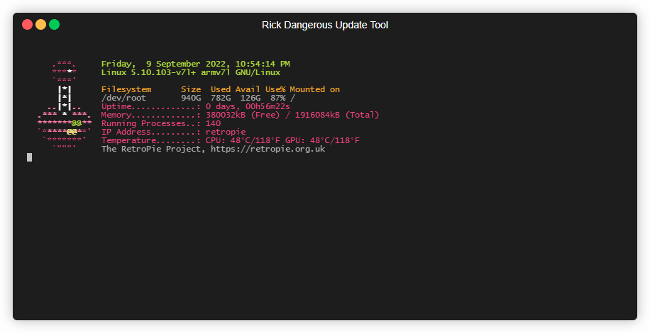
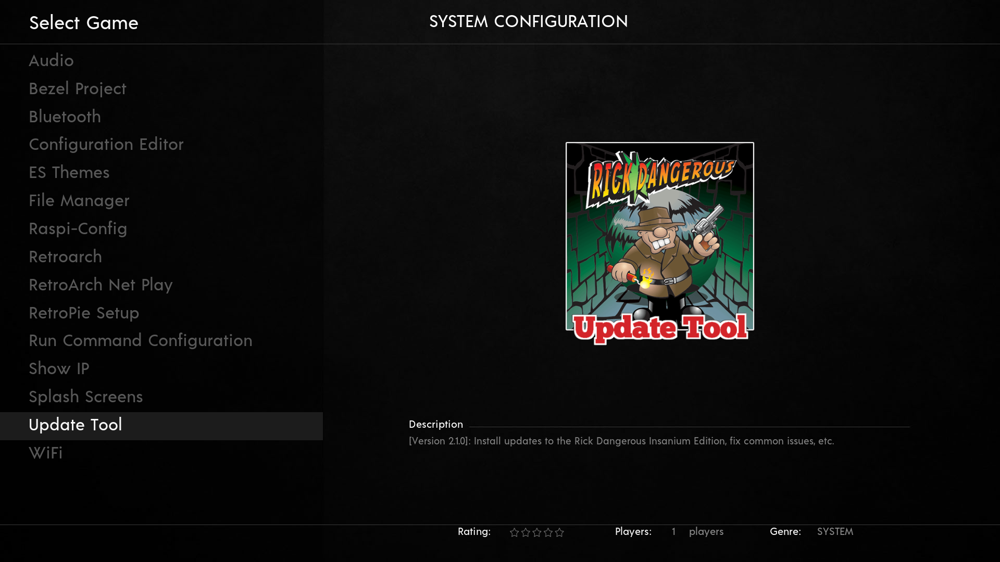

**Disclaimer:** This repository is only for educational purpose. Only use this with your own files/backups.
=============================

This script aims to help people adding improvements, fixing known bugs or resetting certain configurations.
It can be run directly from the retropie and apply updates locally, or you can run it on a device in the same local network by providing ssh credentials.


Join Ricks discord server to keep track on the latest changes.


- [Usage](#usage)
- [Warning](#attention)
- [Features](#features)
  - [Install Improvements](#improvements)
  - [Fix known bugs](#fix-known-bugs)
  - [Restore Retroarch configurations](#restore-retroarch-configurations)
  - [Reset Emulationstation configrations](#reset-emulationstation-configurations)
  - [Enable/Disable System overlays](#system-overlay)
  - [Enable/Disable Handheld mode](#handheld-mode)
- [SSH Instructions](#ssh-usage)


# Usage

Simply run the following command on your Retropie via SSH (this is the recommended way, click [here](#ssh-usage) for further instruction) or access a terminal by connecting a keyboard and pressing F4
(Replace [link] with a URL to the mega storage containing the updates):

```
bash <(curl 'https://raw.githubusercontent.com/h3xp/RickDangerousUpdate/main/run.sh' -s -N) [link]
```

The script is self-explanatory, and it will guide you through the whole process.



## It is recommended to install the tool.

Installation will make the tool available from the "Options" tab in EmulationStation.

Simply select "Installation" in the main menu of the tool to open the "Installation menu".
Now hit "Install/Reinstall" and enjoy the comfort of having the tool directly in EmulationStation.


### After installation you will find a new "Update Tool" entry inside of EmulationStations "Options" tab:


The script will also install a new command "update_tool" with which you can easily run the script from the CLI.

# Attention

The script has been tested, however we can't give a 100% guarantee that it might not break something on
your retropie. Therefore, use this at your own risk.

# Features

1. [Install Improvements](#improvements)
2. [Fix known bugs](#fix-known-bugs)
3. [Restore Retroarch configurations](#restore-retroarch-configurations)
4. [Reset Emulationstation configrations](#reset-emulationstation-configurations)
5. [Enable/Disable System overlays](#system-overlay)
6. [Enable/Disable Handheld mode](#handheld-mode)

## Improvements

This is the "main" feature and reason to create this tool. 
This will allow you to easily select single or multiple updates from a mega drive.

## Fix known bugs

The title is self-explanatory, this feature will easily fix known bugs for you. It is recommended to run these.

## Restore Retroarch configurations

Only use this if you screwed up. This will reset all retroarch configuration files for every system to their original state.

## Reset emulationstation configurations

Only use this if you screwed up. This will reset all emulationstation configurations to their original state.

## System overlay

This lets you easily activate and deactivate the bezels/overlays for each system.

## Handheld mode

This will reset the video settings and deactivate the bezels for these systems to make them more enjoyable on a handheld screen.
Don't use this if you have your retropie connected to a TV.
These systems will be adjusted:

- atarylynx
- gamegear
- gb
- gba
- gbc
- ngpc
- wonderwancolor

## Installation

The three options on the "Installation menu" are:
- Install/Reinstall - this option will install the update tool fresh to the "Options" tab in EmulationStation, overwriting any existing configuration.
- Update - this option will update your version to the most current version available.
- Uninstall/Remove - this option will remove the tool entirely from the "Options" tab in EmulationStation..

# SSH Usage

1. Make sure your pi is connected to the same network as your personal computer.
2. Make sure ssh is installed on your computer.

   - If you are on Windows you can check this by pressing `Windowskey + R` then type `cmd` and hit return.
   - Now a command line windows should have opened. Simply type `ssh` and hit return.
   - If you have ssh installed your output should look like this:

```batch
usage: ssh [-46AaCfGgKkMNnqsTtVvXxYy] [-B bind_interface]
           [-b bind_address] [-c cipher_spec] [-D [bind_address:]port]
           [-E log_file] [-e escape_char] [-F configfile] [-I pkcs11]
           [-i identity_file] [-J [user@]host[:port]] [-L address]
           [-l login_name] [-m mac_spec] [-O ctl_cmd] [-o option] [-p port]
           [-Q query_option] [-R address] [-S ctl_path] [-W host:port]
           [-w local_tun[:remote_tun]] destination [command]
```

   - If it doesnt look like that, you can find help for Windows [here](https://www.howtogeek.com/336775/how-to-enable-and-use-windows-10s-built-in-ssh-commands/)

3. Now you need to know your retropies IP address. The easiest way to get it is by opening the "Options" tab in EmulationStation and use the "Show IP" menu entry.
4. You are all set! Simply run this command in your command line window (`Windowskey + R` then type `cmd` and hit return):

Replace [IP] with the IP adress you just found out and [link] with a URL to the mega storage containing the updates.
```
ssh pi@[IP] bash <(curl 'https://raw.githubusercontent.com/h3xp/RickDangerousUpdate/main/run.sh' -s -N) [link]
```
5. Enjoy!