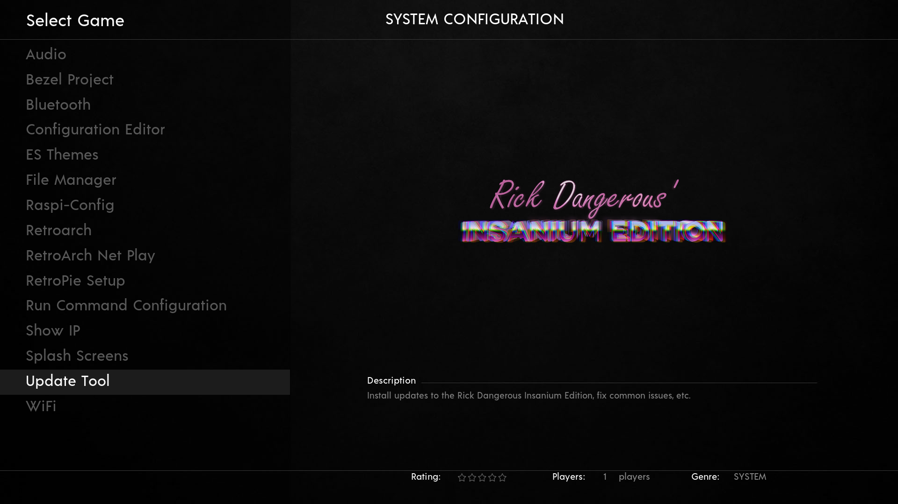

**Disclaimer:** This repository is only for educational purpose. Only use this with your own files/backups.

This script aims to help people adding improvements, fixing known bugs or resetting certain configurations.
It can be run directly from the retropie and apply updates locally, or you can run it on a device in the same local network by providing ssh credentials.


Join Ricks discord server to keep track on the latest changes.


# Usage

Simply run the following command on your Retropie via SSH or access a terminal by connecting a keyboard and pressing F4
(Replace [link] with a URL to the mega storage containing the updates):

```
bash <(curl 'https://raw.githubusercontent.com/h3xp/RickDangerousUpdate/main/run.sh' -s -N) [link]
```

The script is self-explanatory, and it will guide you through the whole process.


## It is recommended to install the tool.

Installation will make the tool available from the "Options" tab in EmulationStation.

Simply select "Installation" in the main menu of the tool to open the "Installation menu".
The three options on the "Installation menu" are:
- Install - this option will install fresh, overwriting any existing configuration.
- Update - this option will update your version to the most current version available.
- Uninstall - this option will remove the tool entirely from the "Options" tab in EmulationStation..

### After installation you will find a new "Update Tool" entry inside of EmulationStations "Options" tab:


# Attention

The script has been tested, however we can't give a 100% guarantee that it might not break something on
your retropie. Therefore, use this at your own risk.
